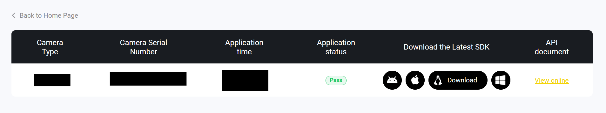

# Setting up the Insta360 ROS 2 Driver (In-Depth Guide)

This guide provides a comprehensive walkthrough for setting up the Insta360 ROS 2 driver on a Unitree Go2 robot (Ubuntu 20.04 / ROS 2 Foxy) using a standard workspace

---

## 1. Environment and Workspace Setup
First, enable the robot's base ROS 2 system and create a clean development workspace.
```bash
# Enable the Unitree ROS 2 environment
source ~/unitree_ros2/setup.sh

# Create the standard workspace structure
mkdir -p ~/ros2_ws/src
cd ~/ros2_ws/src
```

---

## 2. Install Dependencies (Foxy Source Build)
On Ubuntu 20.04, ROS 2 Foxy binaries are often missing or return 404 errors via `apt`. You must build key dependencies from source to ensure `rosdep` can resolve them.

```bash
cd ~/ros2_ws/src

# 1. Clone the Foxy-compatible branch of the camera manager
git clone https://github.com/ros-perception/image_common.git -b foxy

# 2. Clone the IMU tools (required for imu_filter_madgwick)
git clone https://github.com/ccny-ros-pkg/imu_tools.git -b foxy

# 3. Navigate to workspace root to install remaining system dependencies
cd ~/ros2_ws
rosdep update

# Use --skip-keys to prevent rosdep from trying to install the packages we just cloned via apt
rosdep install --from-paths src --ignore-src -r -y --skip-keys "imu_tools imu_filter_madgwick camera_info_manager"
```

---

## 3. Acquire the Insta360 SDK
You will need your Insta360 camera's SDK; you must have an account and request access from the [Insta360 SDK Portal](https://www.insta360.com/sdk/record).



> [!TIP]
> You can right-click on the download button and select "Copy Link Address" to get the direct download link for the SDK, which you can use in the terminal with `wget` or `curl` to download it directly to your robot. It should look something like this: `https://wassets.insta360.com/common/<my_key>/Linux_CameraSDK-2.1.1_MediaSDK-3.1.1.zip`

```bash
cd ~
# Use your direct link here
curl -O [https://wassets.insta360.com/common/](https://wassets.insta360.com/common/)<my_key>/Linux_CameraSDK-2.1.1_MediaSDK-3.1.1.zip

# Extract and clean up zip
unzip Linux_CameraSDK-2.1.1_MediaSDK-3.1.1.zip
rm Linux_CameraSDK-2.1.1_MediaSDK-3.1.1.zip

cd Linux_CameraSDK-2.1.1_MediaSDK-3.1.1

# Pick the appropriate SDK for your system. 
# For Unitree Go2 (ARM64), use the jetson-linux tarball:
tar -xzf CameraSDK-2.1.1-jetson-linux-9.3.0-2020.08-x86_64_aarch64_linux-gnu.tar.gz
```

---

## 4. Install the Driver Source
Clone the driver and move the SDK files into the workspace directories.

```bash
# Clone the driver into your workspace
cd ~/ros2_ws/src
git clone -b humble [https://github.com/ai4ce/insta360_ros_driver](https://github.com/ai4ce/insta360_ros_driver)

# Copy SDK Headers (Note: directory names may vary slightly based on SDK version)
cp -r ~/Linux_CameraSDK-2.1.1_MediaSDK-3.1.1/CameraSDK-20251105_112855-2.1.1-jetson-linux-9.3.0-2020.08-x86_64_aarch64_linux-gnu/include/* ~/ros2_ws/src/insta360_ros_driver/include/

# Copy SDK Libraries
cp ~/Linux_CameraSDK-2.1.1_MediaSDK-3.1.1/CameraSDK-20251105_112855-2.1.1-jetson-linux-9.3.0-2020.08-x86_64_aarch64_linux-gnu/lib/libCameraSDK.so ~/ros2_ws/src/insta360_ros_driver/lib/

# Clean up temp SDK files
cd ~
rm -rf Linux_CameraSDK-2.1.1_MediaSDK-3.1.1
```

---

## 5. Build the Final Driver
Compile the workspace. We use a CMake policy fix to ensure compatibility between Foxy and modern build tools.

```bash
cd ~/ros2_ws
colcon build --symlink-install --cmake-args -DCMAKE_POLICY_VERSION_MINIMUM=3.5 --allow-overriding image_transport
source install/setup.bash
```

> **Verification:** Run `ros2 pkg prefix camera_info_manager`. It should return a path inside `~/ros2_ws/install`.

---

## 6. Hardware Configuration
Before launching, the camera and system permissions must be configured.

### Camera Settings
1. **USB Mode:** Swipe down on the camera screen, go to **Settings > General**, and set USB Mode to **Android**.
2. **Lens Mode:** Ensure the camera is set to **Dual-Lens** mode.

### System Permissions (Udev Rules)
Run the automated setup script or apply the rules manually to grant the driver USB access. (Note: Remember to have the camera on and connected when applying these rules, as the device node must be created for permissions to apply correctly.)

```bash
cd ~/ros2_ws/src/insta360_ros_driver
./setup.sh

# Manual fallback if setup.sh fails:
echo SUBSYSTEM=='"usb"', ATTR{manufacturer}=='"Arashi Vision"', SYMLINK+='"insta"', MODE='"0777"' | sudo tee /etc/udev/rules.d/99-insta.rules
sudo udevadm control --reload-rules
sudo udevadm trigger
sudo chmod 777 /dev/insta
```

---


## 7. Usage
**IMPORTANT:** Every time you open a new terminal, you must source both the Unitree environment and your local workspace, and export the CycloneDDS fix.


```bash
# Required on the Go2 — pin CycloneDDS to the real interface (else discovery fails)
export CYCLONEDDS_URI='<CycloneDDS><Domain><General><Interfaces><NetworkInterface name="eth0"/></Interfaces></General></Domain></CycloneDDS>'

source ~/unitree_ros2/setup.sh
source ~/ros2_ws/install/setup.bash

# Launch the camera driver in EQUIRECTANGULAR mode (what PRISM consumes;
# the driver defaults this arg to false!)
ros2 launch insta360_ros_driver bringup.launch.xml equirectangular:=true
```

> From the VAT repo you can replace all of the above with **`make robot-ros`**,
> which applies the CycloneDDS fix, sources `~/ros2_ws`, and launches the driver
> in equirectangular mode via `robot/ros/bringup_camera.sh`.


# Seting up Zenoh ROS bridge for Cloud Connectivity

This section provides a detailed guide for configuring the Zenoh ROS bridge to enable cloud connectivity for your robot. The Zenoh bridge allows you to seamlessly connect your robot's ROS 2 topics to a cloud-based router using the QUIC protocol. More info can be found in the [Zenoh ROS 2 DDS Plugin](https://github.com/eclipse-zenoh/zenoh-plugin-ros2dds).


We will be using the docker version of the Zenoh bridge for ease of deployment and isolation. The bridge will run as a separate container on the robot, connecting to the local ROS 2 topics and forwarding them to the cloud router.

```bash

docker pull eclipse/zenoh-bridge-ros2dds:latest 

sudo docker run -d \
  --name zenoh-bridge-ros2dds \
  --network host \
  -e ROS_DISTRO=foxy \
  -e CYCLONEDDS_URI='<CycloneDDS><Domain><General><Interfaces><NetworkInterface name="eth0"/></Interfaces></General></Domain></CycloneDDS>' \
  eclipse/zenoh-bridge-ros2dds:latest \
  -e tcp/100.125.156.19:7447
```

> Replace with your server IP


> If already started you can remove with `sudo docker stop zenoh-bridge-ros2dds && sudo docker remove zenoh-bridge-ros2dds`
> Check if any other process is using port 7447 `sudo lsof -i :7447`. If the port is in use, you will need to stop the process that is using it before starting the Zenoh bridge.

> To check logs: `sudo docker logs zenoh-bridge-ros2dds`

## Known Issues:
For some reason my unity came with the wrong port configured for ros2.

```bash
unitree@ubuntu:~$ echo $CYCLONEDDS_URI
<CycloneDDS><Domain><General><Interfaces> <NetworkInterface name="eth1" priority="default" multicast="default" /> </Interfaces></General></Domain></CycloneDDS>
```

so runing the topic list command would fail
```bash
ros2 topic list
```

even though we dont have an eth1 interface. This causes the ros2 bridge to fail to connect to the local ROS 2 topics. To fix this, we need to set the `CYCLONEDDS_URI` environment variable to use the correct interface (eth0) and port (7447).

```bash
export CYCLONEDDS_URI='<CycloneDDS><Domain><General><Interfaces><NetworkInterface name="eth0"/></Interfaces></General></Domain></CycloneDDS>'
```

So now running the topic list command should work and the bridge should be able to connect to the local ROS 2 topics.

```bash
ros2 topic list
```

## Bridge help
```bash
2026-05-05T18:25:10.023254Z  INFO main ThreadId(01) zenoh_bridge_ros2dds: zenoh-bridge-ros2dds v1.9.0
Zenoh bridge for ROS 2 with a DDS RMW

Usage: zenoh-bridge-ros2dds [OPTIONS] [MODE]

Arguments:
  [MODE]  The Zenoh session mode [default: router] [possible values: peer, client, router]

Options:
  -c, --config <CONFIG>
          A configuration file
  -i, --id <ID>
          The Zenoh identifier (as an hexadecimal string, in lowercase - e.g.: a0b23...) that this bridge must use. If not set, a random unsigned 128bit integer will be used. Leading zeros are not accepted. WARNING: this id must be unique in the system and must be 32 chars maximum (128 bits)!
  -e, --connect <CONNECT>
          Endpoints to connect to
  -l, --listen <LISTEN>
          Endpoints to listen on
      --no-multicast-scouting
          Disable the multicast-based scouting mechanism
      --enable-shm
          Enable the shared memory mechanism
  -n, --namespace <NAMESPACE>
          A ROS 2 namespace to be used by the "zenoh_bridge_dds" node'
  -d, --domain <DOMAIN>
          The DDS Domain ID. Default to $ROS_DOMAIN_ID environment variable if defined, or to 0 otherwise [env: ROS_DOMAIN_ID=]
      --ros-localhost-only
          Configure CycloneDDS to use only the localhost interface. If not set, a $ROS_LOCALHOST_ONLY=1 environment variable activates this option.
          When this flag is not active, CycloneDDS will pick the interface defined in "$CYCLONEDDS_URI" configuration, or automatically choose one. [env: ROS_LOCALHOST_ONLY=0]
      --ros-automatic-discovery-range <ROS_AUTOMATIC_DISCOVERY_RANGE>
          Configure CycloneDDS to apply ROS_AUTOMATIC_DISCOVREY_RANGE. The argument only takes effect after ROS 2 Iron [env: ROS_AUTOMATIC_DISCOVERY_RANGE=]
      --ros-static-peers <ROS_STATIC_PEERS>
          Configure CycloneDDS to apply ROS_STATIC_PEERS. The argument only takes effect after ROS 2 Iron [env: ROS_STATIC_PEERS=]
      --pub-max-frequency <REGEX=FLOAT>
          Specifies a maximum frequency of publications routing over zenoh for a set of Publishers.
          The string must have the format "<regex>=<float>":
            - "regex" is a regular expression matching a Publisher interface name
            - "float" is the maximum frequency in Hertz; if publication rate is higher, downsampling will occur when routing.
      --queries-timeout-default <FLOAT>
          A float in seconds that will be used as a timeout when the bridge queries any other remote bridge
          for discovery information and for historical data for TRANSIENT_LOCAL DDS Readers it serves
          (i.e. if the query to the remote bridge exceed the timeout, some historical samples might be not routed to the Readers, but the route will not be blocked forever).
          This value overwrites the value possibly set in configuration file under 'plugins/ros2dds/queries_timeout/default' key [default: 5.0].
  -r, --rest-http-port <PORT | IP:PORT>
          Configures HTTP interface for the REST API (disabled by default, setting this option enables it). Accepted values:
           - a port number
           - a string with format `<local_ip>:<port_number>` (to bind the HTTP server to a specific interface).
  -w, --watchdog [<FLOAT>]
          Experimental!! Run a watchdog thread that monitors the bridge's async executor and reports as error log any stalled status during the specified period [default: 1.0 second]
      --ros-args < list of ROS args until '--' >
          ROS command line arguments as specified in https://design.ros2.org/articles/ros_command_line_arguments.html
          Supported capabilities:
            -r, --remap <from:=to> : remapping is supported only for '__ns' and '__node'
  -h, --help
          Print help (see more with '--help')
  -V, --version
          Print version
```